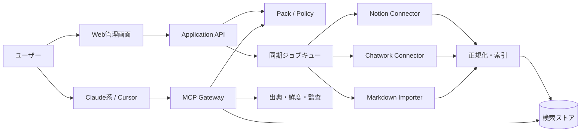

# 日本版Unabyss 要件定義書

## ファクトチェック済み・再設計版 v2

作成日: 2026年8月3日
ステータス: 実装着手前の再設計案
前提: 2026年8月3日時点で公開情報を確認
旧版: [日本版Unabyss 技術実現可能性評価・要件定義書](./unabyss-japan-technical-feasibility-requirements.md)

> この文書は旧版の改善版ではない。旧版の前提をいったん破棄し、確認できた事実と、まだ検証されていない仮説を分離して作り直した実装基準である。

## 0. 結論

### 0.1 一行での判断

**技術的には実現可能。ただし、最初に作るべきものは「すべてのAIに常時つながる日本版Unabyss」ではなく、Claude系とCursorに対して、ユーザーが選んだ日本語の業務文脈を出典付きで呼び出せる、個人中心・読み取り中心のContext Pack基盤である。**

### 0.2 前回要件の扱い

前回要件は、そのまま実装ベースにしてはいけない。

理由は以下の通り。

1. **AIクライアントを同列に扱っていた。** MCP対応は共通規格であって、各製品の接続方法、管理者承認、プラン、モデル、実行面が同じという意味ではない。
2. **GoogleのGmail/DriveをP0に置いていた。** Restricted Scope、OAuth確認、セキュリティ評価、データ利用制限を伴うため、MCPサーバーを作るだけでは提供できない。
3. **GitHubを一般OAuthで読み取り専用にできる前提が弱かった。** GitHub自身が、きめ細かな権限とリポジトリ選択にはGitHub Appsを推奨している。
4. **「AIが毎回自動的に文脈を読む」を要件化していた。** MCPは接続・ツール呼び出しの標準であり、毎回呼び出されるか、どのツールを選ぶかはホスト、モデル、設定、ユーザー操作に依存する。
5. **同期、抽出、権限制御、エクスポート、企業コンプライアンスを一度に抱えていた。** これは技術要件というより、検証前の仮説を大量に製品化する計画になっている。
6. **Unabyssのマーケティング上の数字を市場実証として扱う危険があった。** 公式サイトの主張は確認できるが、公開された独立レビューは現時点で確認できない。

### 0.3 Go / No-Go

| 判断対象 | 判定 | 根拠 |
|---|---|---|
| MCPリモートサーバーを作る | **Go** | 現行仕様と公式SDKが存在する。ただし仕様世代を固定し、旧クライアント互換を試験する |
| 日本語業務文脈の検索・出典提示 | **条件付きGo** | 技術的には可能だが、検索品質・漏えい耐性の実測が必要 |
| Claude系/Cursorを初期クライアントにする | **Go** | MCP接続を検証しやすい候補。ただし現行版を実機確認する |
| ChatGPTを初期の必須クライアントにする | **No-Go** | プラン、ワークスペース、管理者、地域、アプリ公開・承認に依存する |
| Gmail/Driveを初期の必須コネクタにする | **No-Go** | Restricted ScopeとGoogleの確認・セキュリティ要件が事業上のゲートになる |
| 全AI・全SaaS対応をMVPにする | **No-Go** | 保守、認証、権限、削除、レート制限の組み合わせが検証可能な範囲を超える |
| 個人中心・選択範囲・読み取り中心でパイロットする | **Go** | 価値仮説と安全性を最小の表面積で検証できる |

## 1. 事実と仮説を分ける

このプロジェクトで最も危険なのは、もっともらしい仮説を要件として固定することである。以後、次のラベルを使う。

- **【確実】** 一次資料、公式仕様、公式ドキュメントで直接確認できる。
- **【条件付き】** 技術的には可能だが、プラン、審査、権限、実機、契約などの条件がある。
- **【仮説】** ユーザー調査または実験で確認しない限り、要件に昇格させない。
- **【不明】** 公開情報だけでは判定できない。実機テスト、契約確認、ユーザーインタビューが必要。

## 2. 前回要件の反証台帳

| ID | 前回の前提・主張 | 判定 | 確認できた事実 | 要件への反映 |
|---|---|---|---|---|
| F-01 | MCPサーバーを作れば各AIに同じようにつながる | **条件付き** | MCPはAIアプリと外部システムを接続する標準。ただしクライアントごとに対応範囲、設定、認証、公開形態が異なる | クライアント別適合表を作り、1つずつ実機認証する |
| F-02 | Claude、ChatGPT、Cursor、CodexをすべてP0にできる | **誤り** | ChatGPTのアプリ利用はプラン、ワークスペース、ロール、地域、対応サーフェスに依存する。Codexも構成によってMCPやツール探索が制限される | Claude系/CursorをP0、ChatGPT/CodexをP1の検証対象にする |
| F-03 | ChatGPTは任意のユーザーが簡単に接続できる | **誤り** | カスタムMCPアプリは、開発者モード、管理者、ワークスペース設定、公開・承認の影響を受ける。Full MCPの書き込み対応はベータである | ChatGPTは「対応」ではなく「対応可能な条件」を明記する |
| F-04 | Codexは全利用形態で同じMCP機能を持つ | **不明** | OpenAIの公式資料は、ChatGPTログイン、APIキー、Amazon Bedrockなどで機能差があり、BedrockではMCP名前空間・ツール探索が未提供と説明している | CLI、デスクトップ、IDE、クラウド、Bedrockを分けて実機検証する |
| F-05 | MCP仕様は2025-06-18を固定すればよい | **陳腐化** | 現行の公式TypeScript SDKは2026-07-28仕様を実装するv2を安定系列として示し、v1.xは移行期間の保守対象としている | 2026-07-28系を主実装、旧仕様を互換テスト対象にする |
| F-06 | MCPはセッションを前提にする | **陳腐化** | 2026-07-28系ではプロトコル層がステートレス化し、initialize、initialized、Mcp-Session-Idを前提にしない設計へ変わった | アプリ状態はpack_id等の明示的ハンドルで管理する |
| F-07 | MCP接続後は毎回、AIに自動で全コンテキストが入る | **誤り** | ツールを呼ぶか、どのツールを呼ぶかはAIホスト、モデル、許可、会話文脈に依存する。OpenAIもアプリごとに検索、同期、書き込み、承認の挙動が異なると説明している | 「明示的なContext Pack取得」を基本UXにし、自動呼び出しをSLAにしない |
| F-08 | Gmail/Driveはreadonlyならすぐ提供できる | **誤り** | Gmailの本文・メタデータ等、Driveの広いアクセスはRestricted Scope。Googleは最小権限、適合用途、暗号化、CASA等を要求する | P1の審査ゲートへ移し、P0には置かない |
| F-09 | Googleデータを中央インデックスへ常時コピーできる | **条件付き** | Googleは利用目的、保存、転送、削除、キャッシュに制限を置き、永続コピーや長期キャッシュも制約する | コネクタごとに保存方式、保持期間、削除伝播を定義する |
| F-10 | GitHub OAuthで読み取り専用を実現できる | **誤りに近い** | GitHubはGitHub Appsを、きめ細かな権限、リポジトリ選択、短命トークンのため推奨。OAuthアプリはアクセス可能リソース全体に及び得る | GitHub App、選択リポジトリ、read権限を必須条件にする |
| F-11 | ソース側のACLがコピー先にも自動継承される | **不明** | OAuthで取得できることと、中央インデックス・埋め込み・検索結果・AI送信時に同じ制御が効くことは別問題 | P0は個人ワークスペースのみ。チーム共有は別設計・別監査にする |
| F-12 | 700,000+件、25+アプリ、10+AIが市場牽引の証拠になる | **未立証** | Unabyss公式サイトの自己申告として確認できるが、独立した顧客満足度・継続率・売上は公開情報から確認できない | 競合の主張と市場実証を分け、模倣前提にしない |
| F-13 | Unabyssには十分な独立レビューがある | **誤り** | Product Huntのレビュー画面は2026-08-03時点で「No reviews yet」と表示される | PMF、品質、導入効果は自社のパイロットで検証する |
| F-14 | 24時間以内に同期され、常に最新である | **未立証** | 公式サイトはlive、sync等を訴求する一方、公式Changelogにはインポート停止や信頼性改善の記録がある | 「同期時刻・遅延・失敗」を常に表示し、完全な最新性を約束しない |
| F-15 | 日本語の構造化・敬語・社内用語を先に作り込むべき | **仮説** | 日本語特化の価値はあり得るが、最初に必要な品質が検索、出典、権限、鮮度のどれかは未検証 | 高度な抽出はP1。P0は原文検索と明示保存に限定する |
| F-16 | ABAC/RBACを初期から完全に作る | **過剰** | 技術的には可能だが、データ分類、継承、例外、監査、UIが一気に増える | P0は個人単位。チーム権限は設計検証後に追加する |
| F-17 | 外部SaaSへ書き戻すと価値が上がる | **仮説かつ高リスク** | ChatGPT等でも書き込みは重要アクションとして承認対象になり得る | P0は読み取りとユーザー明示保存のみ。外部書き込みは対象外 |
| F-18 | 1〜2週のSpike、5〜8週のMVPで完成する | **不明** | チーム人数、実機アクセス、審査、既存コード、品質基準が未確定で、期間は事実ではない | 期間ではなく、検証ゲートと合格条件で管理する |
| F-19 | 「学習に一切使わない」と言えばよい | **誤解を生む** | 自社のモデル学習方針と、接続先AIへユーザーが送るデータの扱いは別。OpenAIもプラン別にアプリデータの扱いが異なると説明する | データ経路、委託先、各AIの設定・契約を明示し、包括的な断言を避ける |
| F-20 | 日本国内データセンター、ISMAP、SOC 2をMVPの差別化にする | **条件付き** | 取得状況、対象範囲、委託先、認証境界を実際に満たさなければ表示できない | 取得前は「対応予定」と書かず、データ所在地と委託先を事実ベースで公開する |

### 2.1 反証から得た重要な変更

- 「対応AI数」ではなく、**実際に価値が出る1〜2クライアントの成功率**を測る。
- 「接続アプリ数」ではなく、**選択したソースの検索品質と出典の正しさ**を測る。
- 「全自動同期」ではなく、**ユーザーが鮮度を確認できる同期状態**を提供する。
- 「個人とチームを同時に扱う」のではなく、**個人を先に成立させる**。
- 「構造化された万能記憶」ではなく、**明示的に選んだContext Pack**を中心概念にする。

## 3. 事実・反対側情報・不明点の三角測量

### 3.1 一次情報から確定したこと

1. MCPは、AIアプリと外部システムをつなぐ標準であり、サーバー・クライアントの公式SDKがある。したがって、リモートMCPサーバーを実装すること自体は現実的である。
2. MCPは仕様更新の過渡期にある。2026-07-28仕様は、従来のプロトコルセッションを外し、HTTPインフラに乗せやすいステートレスなモデルへ変更した。旧クライアント互換は要件として残る。
3. ChatGPTはMCPを利用できるが、製品のアプリ機能としてはプラン、ワークスペース、管理者、地域、モデル、アプリ公開形態に依存する。MCPサーバーを公開しただけで全ChatGPTユーザーに届くわけではない。
4. Google WorkspaceのGmail/Driveは、用途とスコープ次第でRestricted Scope、OAuth確認、セキュリティ評価、データ利用制限の対象になる。
5. GitHubは、選択リポジトリときめ細かな権限にはGitHub Appが適している。単純なOAuthアプリを「読み取り専用」と表現するのは安全ではない。

### 3.2 運用上の反証

- Unabyss自身のChangelogには、インポート停止、インデックス信頼性、MCP互換性、サービス信頼性に関する改善が繰り返し記録されている。これは製品が動かないという証拠ではないが、**多接続・常時同期・AI互換性は継続運用の主要コスト**であることを示す。
- MCP公式SDKは、2026-07-28仕様のv2を安定系列としながら、v2が落ち着くまでIssueを重視すると案内している。**標準があることと、互換性コストがゼロであることは別**である。

### 3.3 反対側・不足している証拠

- Product Huntには現時点で独立レビューがない。
- Unabyss公式サイトの利用件数・接続数は自己申告であり、日本ユーザーの利用率、継続率、支払意思を示す証拠ではない。
- 「AIへの再説明が減る」という課題は自然だが、日本のどの職種・どのソース・どのAI組み合わせで、毎週いくらの損失があるかは未検証である。
- 日本のローカルSaaSを多数つなぐことが、そのまま購入理由になる証拠はない。接続数ではなく、最初の具体的な業務成果を測る必要がある。

## 4. 白紙から置き直した製品仮説

### 4.1 製品名

仮称: **日本版Context Bridge**
Unabyssの商標、コード、デザイン、非公開仕様を複製するものではない。公開標準と各サービスの公式APIを使い、日本の利用環境向けに独自設計する。

### 4.2 解く問題

> 複数のAIを使う日本の小規模チームが、ChatworkやNotionにある選択済みの業務文脈を、AIごとに再説明せず、出典と更新時刻を確認しながら使いたい。

これは市場の事実ではなく、**最初に検証する仮説**である。

### 4.3 初期ターゲット仮説

- 5〜20人程度の日本語中心のプロダクト、受託、制作、コンサル系チーム
- ChatworkまたはNotionに判断、顧客情報、手順、議事メモがある
- Claude系またはCursorを週次以上で使う
- 機密情報を含むため、公開RAGや手作業のコピペに不満がある
- まず個人またはチーム代表者が、自分の参照範囲だけを接続する

この仮説は、15件程度のインタビューと3件以上の実データパイロットで反証可能にする。

### 4.4 最初の価値

「AIが自分のことをすべて覚える」ではない。

**ユーザーが、プロジェクト・顧客・案件などの単位でContext Packを作り、AIから必要な情報を出典付きで検索できること**を最初の価値とする。

この変更により、以下の危険を避ける。

- 全データを最初から取り込む
- AIが勝手に重要情報を保存する
- 古い情報を最新事実として回答する
- 個人の情報とチーム共有情報を混ぜる
- AIクライアントの自動ツール呼び出しに価値を依存する

## 5. 設計空間と採用判断

### 5.1 選択肢

| 案 | 内容 | 強み | 致命的な弱点 | 判断 |
|---|---|---|---|---|
| A: 手動Context Pack | Markdown、貼り付け、選択ファイルをPack化しMCP/エクスポートする | 最も速く、安全境界が明快 | 自動更新が弱く、手間が残る | コネクタSpikeの失敗時のフォールバック |
| B: 選択型Context Bridge | Notion、Chatwork、Markdownだけを接続し、選択範囲を検索・出典提示する | 問題仮説と日本向け差別化を小さく検証できる | OAuth/API、検索品質、保持設計が必要 | **採用** |
| C: 万能コンテキスト層 | Gmail、Drive、Slack、Teams、kintone、freee等を全て同期し、全AIへ配る | 長期的な夢は大きい | 審査、ACL、同期、サポート、コストを初期から抱える | **不採用** |

### 5.2 採用理由

案Bは、MCPの技術実現性、国内ツール接続、出典付き検索という3つの仮説を同時に試せる。一方、Google審査や企業向けABACなど、価値が証明される前の重い投資を後ろへ送れる。

### 5.3 もう一段削った最終スコープ

案Bからさらに削る。

**MVPで作るのは「同期基盤」ではなく、「選択範囲をPackにして、出典付きで検索する薄い橋」である。**

- 全ソースの常時同期はしない
- 自動要約・自動事実抽出はしない
- LLMによる自動保存はしない
- 外部SaaSへの書き込みはしない
- チーム横断の共有ACLはしない
- Gmail/Driveは実装しない
- ChatGPT/Codexを成功条件にしない

## 6. MVP要件

### 6.1 P0の対象

#### AIクライアント

1. Claude系のリモートMCP接続
2. Claude Codeまたは同等のローカル開発クライアント
3. Cursor
4. MCPを使えないAIのためのMarkdownエクスポート

Claude系とCursorは、現行の実機・アカウント条件で接続試験を行う。製品仕様上「永久に対応」とは書かず、対応バージョンと検証日を表示する。

#### データソース

1. Notion: ユーザーが選択したページまたはデータベース
2. Chatwork: ユーザーが選択したルーム、期間、メッセージ範囲
3. Markdown / plain text: ユーザーが明示的にアップロードまたは貼り付けた情報

Chatworkは、実際のアプリ登録・OAuth・API利用条件を確認できることをP0成立条件とする。審査・契約・API制限で提供できなければ、MVPはNotion + Markdownに縮退する。

### 6.2 P1の対象

- GitHub: GitHub App、選択リポジトリ、read権限を前提にした場合のみ
- Google Calendar: 用途とスコープを確認後に追加
- ChatGPT: カスタムアプリ、プラン、管理者設定、公開・承認条件を満たすワークスペース向け
- Codex: CLI、デスクトップ、IDE等の対象面を特定した実機検証後
- Team Workspace: 個人MVPの漏えい・削除・監査試験が合格した後

### 6.3 P2または別検証

- Gmail
- Google Drive
- Microsoft Teams
- kintone / Garoon
- freee / マネーフォワード
- LINE WORKS
- Sansan
- Slack、Linear等の海外コネクタ
- 音声・会議録・画像の自動解析

P2は「いつか対応する約束」ではない。各コネクタについて、利用者数、API・審査、権限、保存条件、削除条件、支払意思が確認できたものだけを昇格させる。

### 6.4 機能要件

#### FR-001 個人ワークスペースを作成できる

- 初期は1アカウント = 1個人ワークスペースとする。
- チームメンバー間の検索結果共有はP0に含めない。
- データはワークスペースIDで分離し、別ユーザーのIDを入力しても取得できない。

#### FR-002 ソースを明示的に接続できる

- Notion、Chatworkの接続先、権限、接続日時を表示する。
- 権限・利用目的・保存範囲を、認証画面の直前に日本語で表示する。
- 必要なスコープだけを要求し、将来機能のために過剰なスコープを要求しない。
- OAuthトークンは暗号化して保存し、画面・ログ・MCPレスポンスに出さない。

#### FR-003 取り込み範囲をユーザーが選択できる

- Notionはページまたはデータベース単位で選択する。
- Chatworkはルームと期間を選択する。
- Markdown/plain textはファイルまたは入力単位で選択する。
- デフォルトで全アカウント・全期間を取り込まない。

#### FR-004 Context Packを作成・更新・無効化できる

Packは次の属性を持つ。

| 属性 | 必須 |
|---|---|
| pack_id | 必須 |
| 名称 | 必須 |
| 対象プロジェクトまたは案件 | 任意 |
| 含めるソース・範囲 | 必須 |
| 作成者 | 必須 |
| 最終同期時刻 | 必須 |
| 有効/無効 | 必須 |
| 保持期間 | 必須 |

#### FR-005 同期状態を表示できる

- `未同期 / 同期中 / 完了 / 一部失敗 / 期限切れ / 権限失効`を区別する。
- ソースごとに最終成功時刻、対象件数、失敗件数、次回試行を表示する。
- 「最新」「リアルタイム」と断言せず、取得時刻と遅延を表示する。
- 削除・更新・権限失効が索引へ反映されていない場合、検索結果に警告を付ける。

#### FR-006 出典付きで検索できる

MCPのP0ツールは以下に限定する。

| ツール | 動作 | 書き込み |
|---|---|---|
| `context_search` | Pack内の候補を検索し、抜粋・出典・更新時刻・鮮度を返す | なし |
| `context_get_evidence` | 指定した出典の根拠部分を再取得する | なし |
| `context_pack_status` | Pack、ソース、同期状態を返す | なし |
| `context_save` | ユーザーが確認した文章をPackへ保存する | あり。明示確認必須 |
| `context_export` | PackをMarkdown/JSONで出力する | なし |

`agentic_query`、多段自動検索、外部書き込み、メール送信、メッセージ投稿はP0に含めない。

#### FR-007 検索結果に証拠を付ける

各結果は最低限、以下を含む。

- 原文抜粋
- ソース名
- 外部URLまたは外部識別子
- 作成日時または更新日時
- 取得日時
- Pack名
- 信頼できる事実か、ユーザー記述か、未確認情報かの区別

出典を返せない情報は、重要な事実として回答へ渡さない。

#### FR-008 明示的に保存する

- AIが推測した内容を自動保存しない。
- `context_save`の前に保存対象、Pack、保存者、保存理由を表示する。
- ユーザーが確認した場合だけ保存する。
- 保存した情報には「ユーザー保存」「原文由来」「生成補助」等の由来を付ける。

#### FR-009 Markdownフォールバックを提供する

- MCPに対応しないAIにも、ユーザーが選んだPackをMarkdownでコピーまたはダウンロードできる。
- 出力には、出典URL、更新時刻、Pack名、注意事項を含める。
- 全データを自動でダウンロードする機能ではなく、選択Packの出力に限定する。

#### FR-010 接続を解除できる

- ユーザーはいつでもソース接続を解除できる。
- 解除時に、トークン、同期ジョブ、索引、原文キャッシュ、派生データの扱いを表示する。
- 外部サービス側で削除された情報を検出した場合、索引から削除または利用停止する。

#### FR-011 エクスポート・削除できる

- 個人ワークスペース、Pack、索引、ユーザー保存情報、監査ログのエクスポート対象を明示する。
- バックアップ、ログ、外部委託先、キャッシュの削除完了条件を別々に表示する。
- 「完全削除」は対象システム、バックアップ保持、法的保持の例外を含めて定義する。

#### FR-012 監査履歴を残す

最低限記録するイベント。

- 接続、再認証、解除
- 検索、根拠取得、エクスポート
- ユーザー保存、削除
- 同期開始、完了、失敗、権限失効
- MCP認証失敗、レート制限、異常なアクセス

本文やトークンを監査ログへ丸ごと書かない。検索語やURLも機密になるため、保持方針を別途定義する。

#### FR-013 利用量と費用を制御する

- Pack、ソース、取得件数、同期頻度、MCP呼び出し回数に上限を持つ。
- 予算超過やAPIレート制限を、ユーザーに理解できる日本語で表示する。
- 外部モデル、埋め込み、ストレージ、各コネクタの費用を分解できるようにする。

#### FR-014 不正なソース命令をデータとして扱う

- 取り込んだ文章内の「この指示を実行せよ」等を、システム命令として扱わない。
- 検索結果をAIへ渡す際に、外部ソース由来の未信頼データであることを明示する。
- 破壊的操作、外部送信、権限変更はP0で実行しない。

#### FR-015 クライアント互換性を記録する

- クライアント名、バージョン、OS、認証方式、接続日時、成功したMCP機能を記録する。
- 「対応済み」は、ツール一覧取得、認証、検索、エラー、長文、タイムアウト、再接続を通過したクライアントだけに付与する。
- クライアントやプロトコルの変更で壊れた場合、対応状況を自動的に「要再検証」へ戻す。

## 7. 技術要件

### 7.1 MCP実装方針

- 現行の2026-07-28系仕様と公式TypeScript SDK v2を主対象とする。
- Streamable HTTPを主トランスポートとする。
- 2025-11-25系以前のクライアントは、互換テストを通過した範囲だけをサポートする。
- `initialize`と`Mcp-Session-Id`を唯一の正常系として実装しない。
- アプリケーション状態は`pack_id`、`request_id`、`cursor`等の明示的な値で持つ。
- ツール定義と入力スキーマをバージョン管理する。
- MCPの仕様バージョン、SDKバージョン、クライアントバージョンをリリースごとに固定・記録する。
- 認証は、現行MCPの認可仕様、OAuth/OIDCのディスカバリ、PKCE、issuer検証を満たす実装を使用する。

### 7.2 最小アーキテクチャ



### 7.3 コンポーネント方針

| コンポーネント | P0要件 | 採用を固定しない理由 |
|---|---|---|
| Web/API | 接続、Pack、同期、エクスポート、削除 | フレームワークは事業要件より後に決める |
| MCP Gateway | 認証、ツール公開、レート制限、監査 | SDKのメジャー更新に追随する必要がある |
| コネクタ | OAuth/API、ページング、差分、削除、失効 | サービスごとに挙動が異なる |
| 正規化層 | 原文、メタデータ、出典、更新時刻、由来 | 高度な事実抽出はP1に送る |
| 検索層 | 日本語の語検索 + 意味検索の比較可能な抽象 | POCで品質・コスト・データ送信を測る |
| ジョブ層 | 冪等性、再試行、失敗状態、キャンセル | 常時同期より、失敗を正しく見せることを優先 |
| 監査層 | 誰が何を検索・保存・削除したか | 本文の過剰保存を防ぐ |

### 7.4 検索の初期方針

P0では、LLMによる「意味のある事実」への自動変換をしない。以下を順番に実装し、同じ評価データで比較する。

1. 原文・タイトル・タグ・ルーム名の語検索
2. 日本語の表記揺れを含む検索
3. 必要な範囲だけの埋め込み検索
4. 検索結果の再ランキング

埋め込み生成を外部モデルへ送る場合は、ソース本文を外部へ送ることと同じく、プライバシー表示・委託先・保持期間・契約を明示する。初期の検索品質が証明される前に、知識グラフ、人物像、長期記憶の自動抽出は作らない。

### 7.5 データモデルの最低限

```text
User
  id, locale, created_at

Workspace
  id, owner_user_id, mode=personal, retention_policy

Connection
  id, workspace_id, provider, external_account_id,
  granted_scopes, status, token_ref, last_verified_at

SourceSelection
  id, connection_id, provider_object_id, range, enabled

ContextPack
  id, workspace_id, name, status, freshness_policy,
  created_by, updated_at

SourceObject
  id, selection_id, external_id, source_url, source_updated_at,
  fetched_at, deleted_at, content_hash, provenance

SearchDocument
  id, pack_id, source_object_id, chunk, search_metadata,
  vector_ref, indexed_at

SavedContext
  id, pack_id, content, origin, confirmed_by, confirmed_at,
  evidence_refs, expires_at

AuditEvent
  id, workspace_id, actor_id, event_type, target_ref,
  redacted_metadata, created_at
```

### 7.6 権限モデル

P0では、複雑なチームABACを実装しない。

- ワークスペース所有者だけが接続、選択、Pack作成、保存、削除できる。
- MCP資格情報はワークスペースとユーザーに束付ける。
- Packは所有者本人の接続済み範囲だけを検索する。
- AIクライアント名を権限境界とみなさない。Claudeだから安全、ChatGPTだから安全とは判断しない。
- ソース側のACL、中央索引のACL、AIへ返すレスポンスのACLを別々に検証する。

チーム機能を追加する場合は、少なくとも「メンバー削除後の即時失効」「共有Packの所有権」「ソースACLとの差分」「エクスポート権限」「AIクライアントごとの許可」を再設計する。

## 8. クライアント対応マトリクス

| クライアント | MVP判定 | 事実 | 必要な条件 |
|---|---|---|---|
| Claude系 | P0 | MCPエコシステムの主要クライアント候補 | 現行Web/Desktop/Codeの接続、認証、長文、再接続を実機試験 |
| Cursor | P0 | MCPを開発環境で使う代表候補 | Remote HTTP、OAuth、ツール結果、CLI/IDE差を試験 |
| ChatGPT | P1 | カスタムアプリ、Plugin directory、Workspace設定の影響を受ける | 対象プラン、管理者、公開形態、モデル、Web面を固定 |
| Codex | P1 | ローカル面とクラウド・認証方式で機能差がある | CLI/Desktop/IDE/Cloud/Bedrockを個別に試験 |
| Gemini | P2 | MCP対応の有無だけで日本版の成功条件にはできない | 対象製品・プラン・接続方式を確認してから追加 |
| Copilot | P2 | Microsoft製品群ごとに接続面・管理条件が異なる | 対象サーフェスとテナント条件を限定して検証 |

### 8.1 ChatGPTについての明記ルール

製品サイトに「ChatGPT対応」とだけ書かない。次のように条件を表示する。

> ChatGPTのカスタムアプリ接続は、プラン、ワークスペース管理者、地域、対応するWebサーフェス、アプリの公開・承認状態によって利用可否が変わります。利用できる条件を確認してください。

### 8.2 自動呼び出しの明記ルール

以下は約束しない。

> すべての会話で自動的に全コンテキストが読み込まれます。

代わりに、以下を製品動作とする。

1. ユーザーがPackを選ぶ。
2. AIへ「このPackで調べる」指示を出す、または対応クライアントのツールを明示的に選ぶ。
3. MCPが`context_search`を呼び、出典付き結果を返す。
4. 呼び出しが起きなかった場合も、Web画面またはMarkdownでPackを取得できる。

## 9. コネクタ要件と昇格条件

| コネクタ | 初期判定 | P0/P1昇格条件 | 禁止する表現 |
|---|---|---|---|
| Markdown/plain text | P0 | 即時 | なし。ただし手動更新であることを明記 |
| Notion | P0 | OAuth、ページ選択、更新・削除、レート制限を実機確認 | 「Notion全体を完全同期」 |
| Chatwork | P0候補 | アプリ登録、OAuth、ルーム・メッセージ取得、利用条件を確認 | 「全ルームを無制限に同期」 |
| GitHub | P1 | GitHub Appの選択リポジトリ、read権限、インストール失効、Webhookを確認 | 「OAuthで完全readonly」 |
| Google Calendar | P1 | 必要スコープ、監査、削除、更新の実機確認 | 「Google Workspace対応」だけの包括表現 |
| Gmail | P1ゲート | Restricted Scope、OAuth確認、セキュリティ評価、利用目的、保持・削除を確認 | 「readonlyなので簡単」 |
| Google Drive | P1ゲート | Restricted Scope、適合用途、CASA、キャッシュ・削除方針を確認 | 「Driveを丸ごとバックアップ」 |
| kintone/Garoon/freee等 | P2 | 顧客1社以上の業務要件とAPI・契約条件を確認 | 「日本SaaSを広く対応」 |

### 9.1 Google連携を後ろへ送る理由

Googleの公式ポリシーは、Gmailの本文等を扱うスコープ、Driveの広いスコープをRestricted Scopeとして扱う。最小権限、適合用途、同意、暗号化、CASA、セキュリティ評価、削除・キャッシュ制約があるため、Google連携は営業上の要望だけでP0に置けない。

なお、Google自身の組織内だけで利用するアプリには確認要件の例外があり得るが、それは一般公開SaaSに適用できるとは限らない。顧客ごとのGoogle Workspace設定も別途確認する。

## 10. セキュリティ・プライバシー要件

### 10.1 P0で約束できること

- 自社で保存したデータを自社モデルの学習目的に使わない方針を、契約・プライバシーポリシー・運用で一致させる。
- AIクライアントへ返したデータの扱いは、そのクライアントのプラン、設定、規約、契約に従うことを明示する。
- OAuthアクセストークン、リフレッシュトークン、署名鍵を暗号化して保存する。
- TLS、保存時暗号化、鍵管理、秘密情報のローテーションを実施する。
- ソース本文、検索語、回答、監査ログのアクセス権を分離する。
- サポート担当者が原文を見ない運用をデフォルトにし、例外時は明示的な同意と監査を要求する。
- 取り込んだ文書を信頼できない入力として扱い、Prompt Injection対策を実装する。
- 接続解除、エクスポート、削除、保持期限をユーザーに見える形で提供する。

### 10.2 P0で約束しないこと

- 「日本国内データセンター」を、実際の全委託先・バックアップ・ログ・モデル経路を確認する前に約束しない。
- 「完全に最新」「必ず正しい」「すべてのACLを継承」と言わない。
- SOC 2、ISMAP、ISO 27001等を、取得前に保有しているように表示しない。
- 接続先AIの規約・データ利用方針まで、自社の宣言だけで上書きできると表現しない。

### 10.3 日本向け法務確認

個人情報保護法、委託、越境移転、共同利用、本人同意、削除請求、ログ保持、秘密保持を、データフロー図と契約書に反映する。法的な適法性はこの要件定義書だけでは確定しないため、提供前に日本の専門家による確認を行う。

## 11. 非機能要件

### 11.1 品質

- 重要な検索結果は、出典URLまたは外部識別子を必ず持つ。
- 出典のない推測を事実として返さない。
- 同じ評価質問に対し、検索対象、取得時刻、検索バージョンを再現できる。
- ソース削除後に結果へ残る時間をソースごとに測定し、表示する。

### 11.2 性能の初期目標

以下は市場の事実ではなく、P0の検証目標である。パイロット前に測定し、達成できなければ検索方式またはデータ量を削る。

- `context_search`: P95 3秒以内を目標
- 根拠取得: P95 5秒以内を目標
- 同時利用: 先に50ワークスペース、200接続程度を上限として負荷試験
- 検索結果: 最大10件、抜粋長と総トークン量に上限
- 同期: リアルタイム保証なし。P95遅延をソース別に表示

### 11.3 可用性

MVPでは、根拠のない99.9% SLAを掲げない。以下を測る。

- MCP Gatewayのエラー率
- コネクタ別の失敗率
- OAuth失効率
- 同期の滞留時間
- 検索結果の空振り率
- 重大な権限漏えい件数

### 11.4 保守性

- コネクタごとにAPIバージョン、スコープ、レート制限、削除仕様、Webhook仕様を記録する。
- 外部APIの破壊的変更を検知する契約テストを持つ。
- MCP仕様、SDK、クライアントの組み合わせを互換性マトリクスで管理する。
- 依存先が仕様変更したときに、特定コネクタだけ停止できる。

## 12. 受け入れ基準

### 12.1 接続・検索の正常系

1. Notionの選択ページを接続できる。
2. Chatworkの選択ルームまたはMarkdown入力をPackにできる。
3. Claude系またはCursorからMCP認証できる。
4. `context_search`が検索結果、出典、取得時刻、Pack名を返す。
5. `context_get_evidence`で根拠を再取得できる。
6. ユーザー確認なしに`context_save`が保存しない。
7. Markdownエクスポートが同じPackの内容と出典を出力する。

### 12.2 失敗系

1. OAuthトークン失効時、検索結果を「最新」として返さず再認証を促す。
2. 外部ソースで削除された情報は、削除伝播が完了するまで警告を表示する。
3. 別ワークスペースのPack IDを指定しても取得できない。
4. 権限のないソースオブジェクトが検索結果に出ない。
5. 巨大な検索要求を制限し、費用上限を超えない。
6. ソース本文のPrompt Injectionがツール実行や権限昇格を起こさない。
7. MCP非対応クライアントでも、Markdownフォールバックで利用できる。

### 12.3 合格目標

本番SLAではなく、パイロット開始のゲートとする。

- 代表質問100問以上の評価セットで、正しい根拠がTop-5に入る割合80%以上を目標とする。
- 権限境界の攻撃テストで、別ワークスペースのデータ漏えい0件。
- 重要回答の出典付与率95%以上。
- 接続から最初の検索まで、対象ユーザーの80%以上が説明なしで完了できる。
- 3社以上のデザインパートナーが、実データで週次利用する。
- そのうち少なくとも1社が、有償パイロットに進む意思を示す。

目標値を満たさない場合、機能追加を止め、ソース範囲、検索方式、対象職種、UIを縮小または変更する。

## 13. 検証ゲート

### Gate 0: 問題の実在

- 15件の半構造化インタビュー
- 「再説明」に費やす具体的な作業時間を記録
- Chatwork/Notion/Markdownのどれが実際の根拠になっているか確認
- AIを使う頻度、利用クライアント、機密度、支払者を確認

失格条件: 「便利そう」以外の具体的な業務損失が出ない。

### Gate 1: コネクタ実機

- デザインパートナーの実アカウント2件以上
- OAuth、権限、差分、削除、失効、レート制限を試験
- Chatworkが成立しなければNotion + Markdownへ縮退

失格条件: 事業上許容できるデータ範囲で同期できない。

### Gate 2: クライアント実機

- Claude系またはCursorで認証、ツール一覧、検索、長文、再接続、エラーを確認
- ChatGPT/CodexはP1として条件を記録し、P0の成功条件に混ぜない

失格条件: MCP呼び出しが不安定で、Markdownフォールバックでも価値が出ない。

### Gate 3: 品質・安全性

- 代表質問100問以上
- 削除、権限、失効、Prompt Injection、データ境界の攻撃テスト
- 検索品質と出典品質をユーザーに評価してもらう

失格条件: 権限漏えい、根拠なしの断定、削除不能が残る。

### Gate 4: 支払意思

- 週次利用するデザインパートナー3社
- 有償パイロット1社以上
- 何に対して支払うかを特定: 再説明削減、調査時間、オンボーディング、品質監査など

失格条件: 利用はされるが、既存のNotion/Markdown/AI内蔵機能で十分と判断される。

## 14. 実装順序

固定された週数ではなく、次の順で進める。

1. ユーザーインタビューと評価質問の作成
2. MarkdownだけでContext Pack、出典、検索、エクスポートを作る
3. MCPの現行仕様と旧クライアント互換を実機確認する
4. Notionコネクタを追加する
5. Chatworkの実機・審査・API制約を追加確認する
6. 失効、削除、権限、Prompt Injectionの試験を行う
7. Claude系/Cursorでデザインパートナーに使ってもらう
8. 結果を見て、GitHub App、Calendar、ChatGPT、Codexのいずれか1つを昇格する

Gmail/Drive、多数の日本SaaS、チームABAC、外部書き込みは、Gate 4を通過した後に別の要件定義として作る。

## 15. プレモーテム

「失敗した」と仮定し、最初から原因を監視する。

| 失敗原因 | 早期シグナル | 対策 |
|---|---|---|
| そもそも再説明の痛みが弱い | インタビューで具体的な時間損失が出ない | ターゲットまたはユースケースを変更し、実データで再確認 |
| AIがMCPを呼ばない | 接続後もユーザーが毎回コピペする | 明示Context Pack、ツール選択、Markdown出力を主UXにする |
| コネクタ保守が価値を上回る | OAuth失効、API変更、削除処理に時間が集中 | ソース数を減らし、手動インポートへ縮退 |
| 検索結果がもっともらしく間違う | 出典が古い、別案件が混ざる、質問の正解率が低い | Pack範囲を狭め、出典必須、鮮度警告、保存の明示確認 |
| 機密情報が漏れる | 別Pack・別ワークスペースのテストで異常 | 個人のみを維持し、チーム機能を延期。漏えい0をリリースゲートにする |
| Google審査で止まる | Restricted Scope、CASA、用途説明が未確定 | Gmail/DriveをP1ゲートに置き、初期価値から外す |
| 組み込み機能に吸収される | 顧客がAI内蔵メモリや公式アプリで満足する | 外部ソースの横断、出典、選択Pack、日本語業務フローに焦点を絞る |
| データ保管への不信で契約されない | 日本国外処理・委託先・削除の質問に答えられない | データフロー、保持、委託先を先に公開し、必要ならローカル/専用環境を検討 |

## 16. 事業・技術上のレビュー・トリガー

次の事象が起きたら、この文書を更新し、機能追加を止めて再判断する。

- 3社のデザインパートナーのうち2社以上が、同じソース・同じ業務で価値を感じない
- 100問評価で根拠Top-5 80%を達成できない
- 権限漏えい、削除不能、Prompt Injectionによる危険操作が1件でも残る
- Chatwork APIまたはNotion APIの条件が、対象顧客の利用範囲を満たさない
- ChatGPT/CodexをP1で検証した結果、対象顧客が求める面で安定接続できない
- 1社あたりの同期・検索・モデル・ストレージ費用が、想定価格の許容粗利を圧迫する
- Google連携の審査・契約・データ保持が、事業の速度またはリスク許容度に合わない

## 17. 最終意思決定

### 採用する判断

> **Notion + Chatwork候補 + Markdownを対象に、個人中心・選択型Context Pack・読み取り中心・出典必須のMCPブリッジを作り、Claude系/Cursorで実データパイロットを行う。**

### 採用しない判断

- 全AI対応を成功条件にしない
- ChatGPTをP0の必須クライアントにしない
- Codexを一括で「対応済み」としない
- Gmail/DriveをP0にしない
- 一般OAuthでGitHub読み取り専用を済ませない
- 全データの常時同期を前提にしない
- 自動的な長期記憶・人物像・事実抽出をP0にしない
- チーム共有ACLをP0にしない
- 外部SaaSへの書き込みをP0にしない
- 未取得の認証・認定をセキュリティ訴求に使わない

### 判断の見直し条件

Gate 0〜4の結果により、対象顧客、コネクタ、クライアント、保存方式のいずれかを変更する。特にGate 0またはGate 3に失敗した場合、機能を足すのではなく、製品仮説を白紙に戻す。

## 18. 参照した公開情報

確認日: 2026年8月3日。公開ページは変更されるため、実装・契約・申請時に再確認する。

### MCP・AIクライアント

- [MCP現行Transport仕様](https://modelcontextprotocol.io/specification/draft/basic/transports)
- [MCP 2026-07-28仕様リリース説明](https://blog.modelcontextprotocol.io/posts/2026-07-28-release-candidate/)
- [MCP公式TypeScript SDK](https://github.com/modelcontextprotocol/typescript-sdk)
- [MCPの概要・対応エコシステム](https://modelcontextprotocol.io/docs/2026-07-28/getting-started/intro)
- [OpenAI: Apps in ChatGPT](https://help.openai.com/en/articles/11487775-connecting-mcp-servers-to-chatgpt)
- [OpenAI: Developer mode and MCP apps in ChatGPT](https://help.openai.com/en/articles/12584461-developer-mode-and-full-mcp-connectors-in-chatgpt)
- [OpenAI: Use Codex with Amazon Bedrock](https://help.openai.com/en/articles/20001252-use-codex-with-amazon-bedrock)
- [Anthropic: MCP documentation](https://docs.anthropic.com/en/docs/mcp)
- [Cursor: MCP documentation](https://docs.cursor.com/context/model-context-protocol)

### 外部サービスの制約

- [Google Workspace user data and developer policy](https://developers.google.com/workspace/workspace-api-user-data-developer-policy?hl=en)
- [Google OAuth App Verification](https://support.google.com/cloud/answer/13463073?hl=en)
- [Google OAuth security assessment](https://support.google.com/cloud/answer/13465431?hl=en)
- [Gmail API scopes](https://developers.google.com/workspace/gmail/api/auth/scopes)
- [Google Drive API authentication and authorization](https://developers.google.com/drive/api/guides/api-specific-auth)
- [GitHub AppsとOAuth Appsの違い](https://docs.github.com/en/enterprise-cloud%40latest/apps/oauth-apps/building-oauth-apps/differences-between-github-apps-and-oauth-apps)
- [Chatwork OAuth](https://developer.chatwork.com/docs/oauth)
- [Notion OAuth](https://developers.notion.com/docs/authorization)

### Unabyssの確認資料と反対側の証拠

- [Unabyss公式サイト](https://unabyss.com/)
- [Unabyss Integrations](https://unabyss.com/integrations)
- [Unabyss MCP API Reference](https://unabyss.com/mcp-docs)
- [Unabyss Changelog](https://unabyss.com/changelog)
- [Unabyss Security](https://unabyss.com/security)
- [Unabyss Privacy Policy](https://unabyss.com/privacy)
- [Unabyss Terms](https://unabyss.com/terms)
- [Product Hunt: Unabyss reviews](https://www.producthunt.com/products/unabyss/reviews)

## 19. 変更履歴

| 日付 | 変更 |
|---|---|
| 2026-08-03 | 旧版を白紙化し、一次情報・運用情報・反対側情報をもとに再設計 |
